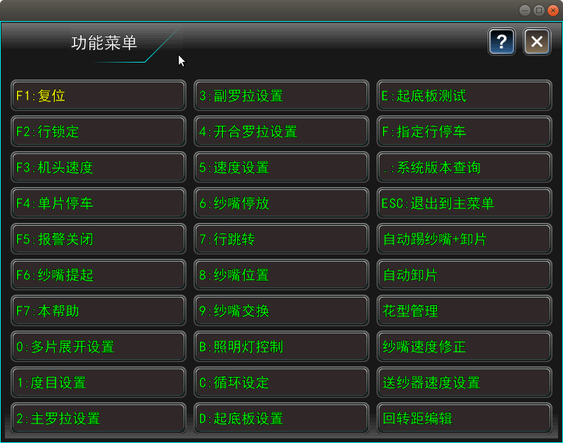

# F7帮助

### 供客户随时查看系统显示操作屏按键的帮助说明

**触摸**：在运行监控画面点击该键弹出\[功能菜单\]，退出请点击右上角\[×\]退回至\[编织运行\]界面，或者点击**\[ESC：退出到主菜单\]**退至主界面。  
**按键**：在运行监控画面按 **F8** 键弹出\[功能菜单\]，按 **Esc** 键退出当前界面返回至\[编织运行\]界面。

**说明**：此界面各项参数前的符号为快捷按键，在\[编织运行\]界面按对应的按键，会跳转到相应的界面。

### 0：多片展开设置

**设置机头运行过程中的多片同时编织功能**

**触摸**：点击 **\[0：多片展开设置\]** 图标，显示为黄色字体，弹出\[多片展开设置\]界面，根据当前工作花型的宽度填写\[展开片数\]和\[间隔真数\]，选择是否打开\[废纱纱嘴\]和\[纱嘴共用\]功能，同时在下方蓝色参数框输入  
需要使用的纱嘴编号。完成后可点击右上角\[×\]退回至\[编织运行\]界面。  
**按键**：方向键移动光标选择 **\[0：多片展开设置\]** 图标，按 **Enter** 键进入\[多片展开设置\]界面，通过方向键移动光标选择需要修改的参数框，按回车键弹出小键盘，根据需求输入数值，再次按 **Enter** 键完成输入，按 **Esc** 键退出。

系统最大展开片数：10（1－10）  
系统默认展开片数：1

#### **多片度目微调**

**触摸**：当多片设置开启时，点击页面左下方的\[度目\]进入\[多片度目微调\]界面，根据实际编织情况，对不同编织片的不同段号对应的度目进行微调。双击选定蓝色参数框，弹出小键盘，输入需要设定的参数值。点击\[清除\]和\[总清\]可以对不同范围的参数值进行清除，完成后可点击右上角\[×\]退回至\[编织运行\]界面。  
**按键**：在\[多片度目微调\]界面下，通过方向键移动光标选择需要修改的参数框，按 **Enter** 键弹出小键盘，根据需求输入数值，再按 **Enter** 键完成输入，按 **Esc** 键退出。

数值范围：-50 ~ 50

#### **边缘度目微调**

具体操作及说明见下方**\[1：度目设置\]**的边缘度目微调部分

#### **说明**：

1.打开\[废纱纱嘴\]和\[纱嘴共用\]功能会影响多片编织中纱嘴编号的选择  
2.请根据横机总针数、花样宽度、纱嘴多少进行合理设置

### 1：度目设置

**对机头运行时的系统工作度目参数进行设置**

**触摸**：单击**\[1：度目设置\]**图标，显示为黄色字体，弹出\[工作度目设置\]界面，不同系统度目电机数量不同，白色字体为当前使用的度目段号，灰色字体为未使用度目段号。双击度目段号和电机编号对应的蓝色参数框，弹出小键盘，输入需要设定的参数值。完成后可点击右上角\[×\]退回至\[编织运行\]界面。  
**按键**：方向键移动光标选择**\[1：度目设置\]**图标，按“Enter”键弹出\[工作度目设置\]界面，通过方向键移动光标选择需要修改的参数框，按 **Enter** 键弹出小键盘，根据需求输入数值，再次按 **Enter** 键完成输入，按 **Esc** 键退出。

数值范围： 0－650

#### 参数复制

**触摸**：其它段与设置段参数相等时，点击左下角\[复制\]弹出\[度目复制\]提示框，根据需要选择参数复制范围。  
**按键**：其他段与设置段参数相等时，按**\[C&lt;—\]**键弹出提示框，根据需要选择参数复制范围。

#### **边缘度目微调**

**\[边缘度目\]：在当前针板花型工作区两侧，根据编织需要调整一定数量织针的度目以达到对织物松紧程度的改变。**

**触摸**：点击页面左下角\[边缘微调\]，弹出\[边缘度目微调\]界面，选择需要修改的段号对应区，双击弹出小键盘，输入需要设定的参数值。点击左下角的\[复制\]可实现同一段号内部的参数统一，点击\[删除\]可删除当前选定框的输入值。完成后可点击右上角\[×\]退回至\[编织运行\]界面。  
**按键**：在\[边缘度目微调\]界面下，通过方向键移动光标选择需要修改的参数框，按 **Enter** 键弹出小键盘，根据需求输入数值，再按 **Enter** 键完成输入，按 **Esc** 键退出。

数值范围： -100 ~ 100 （度目）；0 ~ 100 （针数）

**提醒**：

若当前花型设置多片展开，则可通过页面下方的\[下片\]翻至另一片设置界面进行度目设置。若参数设置和基准片一致，可直接点击\[继承\]弹出提示框：**是否继承基准片设置？**，点击\[确认\]复制基准片所有参数值。点击\[取消\]取消当前操作。另外点击\[上片\]\[下片\]进行翻片过程中若对当前界面有参数修改，会弹出**是否保存修改**提示框，点击\[确认\]保存。点击\[取消\]取消当前操作。

#### **先行度目**

**\[先行度目\]：机头运行过程中先进入工作区的一侧度目为先行度目**

**触摸**：点击页面左下角\[**先行度目**\]，弹出\[先行度目设置\]界面，选择需要修改的段号对应区，双击弹出小键盘，输入需要设定的参数值。点击左下角的\[复制\]、\[前板复制\]、\[后板复制\]选择参数复制范围。完成后可点击右上角\[×\]退回至\[编织运行\]界面。  
**按键**：在\[先行度目设置\]界面下，通过方向键移动光标选择需要修改的参数框，按 **Enter** 键弹出小键盘，根据需求输入数值，再按 **Enter** 键完成输入，按 **Esc** 键退出。

数值范围：0－650

#### **说明：**

度目设置编号定义：  
1系统：后度目三角：1  2；前度目三角：3  4；  
2系统：后度目三角：1  2  3  4；前度目三角：5  6  7  8；  
3系统：后度目三角：1  2  3  4  5  6；前度目三角：7  8  9  10  11  12；

### 2：主罗拉设置

**设定机头编织时主罗拉向下牵拉织物的指令（拉力）**

**触摸**：点击**\[2：主罗拉设置\]**图标，显示为黄色字体，弹出\[主罗拉编辑\]界面，白色字体为当前使用的罗拉段号，灰色字体为未使用罗拉段号。双击蓝色参数框弹出小键盘，输入需要设定的参数值。完成后可点击右上角\[×\]或左下角\[退出\]退回至\[编织运行\]界面。  
**按键**：方向键移动光标选择**\[2：主罗拉设置\]**图标，按 **Enter** 键弹出\[主罗拉编辑\]界面，通过方向键移动光标选择需要修改的参数框，按 **Enter** 键弹出小键盘，根据需求输入数值，再次按 **Enter** 键完成输入，按 **Esc** 键退出。

设定段数：32段（\#XX为工艺段号）   
数值范围：0－100 （罗拉）；0－100（力矩）

#### **参数复制**

**触摸**：其它段与设置段参数相等时，点击左下角\[复制\]弹出提示框：**参数复制**，点击\[确认\]实现全部段复制，即将所有段号罗拉均设定为当前输入值；点击\[取消\]取消当前操作。  
**按键**：其它段与设置段参数相等时，按**\[C&lt;—\]**键弹出提示框，按 **Enter** 键确认。

#### **说明：**

停车力矩：  
设定机头停止运行时，牵拉自动停止并保持的拉力（力矩电机）。 

应按编织结构和编织宽度设置卷布拉力数据。设定数值大小与拉力成正比关系，数值越大，卷动越快，拉力越大。

### 3：副罗拉设置

**设定机头编织时副罗拉向下牵拉织物的指令（拉力）**

**触摸**：点击**\[3：副罗拉设置\]**图标，显示为黄色字体，弹出\[副罗拉编辑\]界面。白色字体为当前使用的罗拉段号，灰色字体为未使用罗拉段号。双击蓝色参数框弹出小键盘，输入需要设定的参数值。完成后可点击右上角\[×\]或左下角\[退出\]退回至\[编织运行\]界面。  
**按键**：方向键移动光标选择**\[3：副罗拉设置\]**图标，按 **Enter** 键弹出\[副罗拉编辑\]界面，通过方向键移动光标选择需要修改的参数框，按 **Enter** 键弹出小键盘，根据需求输入数值，再次按 **Enter** 键完成输入，按 **Esc** 键退出。

设定段数：32段（\#XX为工艺段号）   
数值范围：0－100 （罗拉）；0－100（力矩）

#### **参数复制**

**触摸**：其它段与设置段参数相等时，点击左下角\[复制\]弹出提示框：**参数复制**，点击\[确认\]实现全部段复制，即将所有段号罗拉均设定为当前输入值；点击\[取消\]取消当前操作。  
**按键**：其它段与设置段参数相等时，按**\[C&lt;—\]**键弹出提示框，按 **Enter** 键确认。

#### **说明**：

停车力矩：  
设定机头停止运行时，牵拉自动停止并保持的拉力（力矩电机）。

应按编织结构和编织宽度设置卷布拉力数据。设定数值大小与拉力成正比关系，数值越大，卷动越快，拉力越大。

### 4：开合罗拉设置

**设定机头编织时的开合罗拉**

**触摸**：点击**\[4：开合罗拉设置\]**图标，显示为黄色字体，弹出\[开合罗拉编辑\]界面，白色字体为当前使用的罗拉段号，灰色字体为未使用罗拉段号。触笔双击蓝色参数框弹出小键盘，输入需要设定的参数值。完成后可点击右上角\[×\]或左下角\[退出\]退回至\[编织运行\]界面。  
**按键**：方向键移动光标选择**\[4：开合罗拉设置\]**图标，按回车键弹出\[开合罗拉编辑\]界面，通过方向键移动光标选择需要修改的参数框，按 **Enter** 键弹出小键盘，根据需求输入数值，再次按 **Enter** 键完成输入，按 **Esc** 键退出。

设定段数：32段（\#XX为工艺段号）   
数值范围：0－100 （罗拉）；0－100（力矩）

#### **参数复制**

**触摸**：其它段与设置段参数相等时，点击左下角\[复制\]弹出提示框：**参数复制**，点击\[确认\]实现全部段复制，即将所有段号罗拉均设定为当前输入值；点击\[取消\]取消当前操作。  
**按键**：其它段与设置段参数相等时，按**\[C&lt;—\]**键弹出提示框，按 **Enter** 键确认。

#### **说明**：

停车力矩：  
设定机头停止运行时，牵拉自动停止并保持的拉力（力矩电机）。

步进主罗拉：  
设定数值大小与罗拉打开成正比关系，数值越大，打开越大。 

力矩开合罗拉：  
设定数值大小与罗拉打开成反比关系，数值越大，打开越小。

### 5：速度设置

**用于控制机头编织的移动速度设置**

**触摸**：点击**\[5：速度设置\]**图标，显示为黄色字体，弹出\[机头速度编辑\]界面，白色字体为当前使用的速度段数，灰色字体为未使用速度段数。双击蓝色参数框弹出小键盘，输入需要设定的参数值。完成后可点击右上角\[×\]或左下角\[退出\]退回至\[编织运行\]界面。  
**按键**：方向键移动光标选择**\[5：速度设置\]**图标，按 **Enter** 键弹出\[机头速度编辑\]界面，通过方向键移动光标选择需要修改的参数框，按 **Enter** 键弹出小键盘，根据需求输入数值，再次按回车键完成输入，按 **Esc** 键退出。

设定段数：32段 （\#XX为工艺段号）  
数值范围：0－100 

#### **参数复制**

**触摸**：其它段与设置段参数相等时，点击左下角\[复制\]弹出提示框：**参数复制**，点击\[确认\]实现全部段复制，即将所有段号速度均设定为当前输入值；点击\[取消\]取消当前操作。  
**按键**：其它段与设置段参数相等时，按**\[C&lt;—\]**键弹出提示框，按 **Enter** 键确认。

#### **说明**：

设定数值大小与编织速度成正比关系，数值越大，编织越快。

#### **有如下指令的行保持低速**

1.执行起始操作的第一 行和有结束指令的行   
2.自动停机后使用拉杆再次启动时的第一行

### 6：纱嘴停放

**用于编辑纱嘴的停放位置**

横向坐标：\[组1\]-\[组8\]，纱嘴停放点组，一般由制版时设定。  
****纵向坐标：\#1-\#8纱嘴，\#11-\#18纱嘴（两侧）  
设定组别：8（组）   
设定纱嘴：16（把）   
数值范围：0－30   
组别下方左、右侧停放点说明 ：  
左侧数值：左侧停放点  
右侧数值：右侧停放点 

**触摸**：点击**\[6：纱嘴停放\]**图标，显示为黄色字体，弹出\[纱嘴停放点编辑\]界面，双击设定组和纱嘴编号对应的蓝框，弹出小键盘，输入设定数值，设定完成后可点击右上角\[×\]或左下角\[退出\]退回至\[编织运行\]界面。  
**按键**：方向键移动光标选择**\[6：纱嘴停放\]**图标，按 **Enter** 键弹出\[纱嘴停放点编辑\]界面，通过方向键移动光标选择需要修改的参数框，按 **Enter** 键弹出小键盘，根据需求输入数值，再次按 **Enter** 键完成输入，按 **Esc** 键退出。

#### **参数复制**

**触摸**：其它段与设置段参数相等时，点击左下角\[复制\]弹出提示框：**参数复制**，点击\[确认\]实现全部段复制，即将所有段号速度均设定为当前输入值；点击\[取消\]取消当前操作。  
**按键**：其它段与设置段参数相等时，按**\[C&lt;—\]**键弹出提示框，按 **Enter** 键确认。

#### **速度修正**

具体参数设置参照下方的**\[纱嘴速度修正\]**说明

#### **说明**：

停放位置设置数值越大，纱嘴离编织区越远。

### 7：行跳转

**设定机头跳行编制功能**

**触摸**：点击**\[7：行跳转\]**图标，显示为黄色字体，弹出提示框：**请输入跳转行号：**，并弹出小键盘，从小键盘输入需要跳转的行数，点击\[确定\]输入行数并跳转，同时退回至\[进入编织\]界面；点击\[退出\]取消当前操作并退回至\[编织运行\]界面。  
**按键**：方向键移动光标选择**\[7：行跳转\]**图标，按 **Enter** 键弹出输入跳转行提示框，同时弹出小键盘，根据需求输入跳转行号，再次按 **Enter** 键完成输入，按 **Esc** 键退出。

### 8：纱嘴位置

**设定纱嘴交换和叠纱功能**

**触摸**：点击**\[8：纱嘴位置\]**图标，显示为黄色字体，弹出\[纱嘴编辑\]界面，白色字体为当前运行花型中使用到的纱嘴编号，灰色字体为未使用编号纱嘴。双击蓝色参数框弹出小键盘，通过小键盘输入需要交换的纱嘴编号，修改完成后点击右上角\[×\]或者左下角\[退出\]回到\[编织运行\]界面。  
**按键**：方向键移动光标选择**\[8：纱嘴位置\]**图标，按 **Enter** 键弹出\[纱嘴编辑\]界面，通过方向键移动光标选择需要修改的参数框，按 **Enter** 键弹出小键盘，根据需求输入纱嘴编号，再次按 **Enter** 键完成输入，按 **Esc** 键退出。

#### **宽纱嘴**

点击页面左下角\[宽纱嘴\]，可设置机头工作时同时携带两把纱嘴，用于编制特定花型时使用。

#### **说明**：

纱嘴交换不会修改动作文件中的纱嘴，当该花样输出至U盘时，交换信息不会带出。

### 9：纱嘴交换

**设定纱嘴交换和叠纱功能**

_同**\[8：纱嘴位置\]**弹出界面和功能操作相同_

### B：照明灯控制

**仅显示功能图标，需退回至\[进入编织\]界面进行照明灯控制操作**

### C：循环设定

**设定编织时的数据循环（节约）**

**触摸**：点击**\[C：循环设定\]**图标，显示为黄色字体，弹出\[循环设定\]界面，双击蓝色参数框弹出小键盘，通过小键盘输入\[开始行、结束行、循环数\]的设定数值，完成后点击右上角\[×\]或左下角\[退出\]回到\[编织运行\]界面。点击右下角\[删除\]可删除选定组的循环设定。  
**按键**：方向键移动光标选择**\[C：循环设定\]**图标，按 **Enter** 键弹出\[循环设定\]界面，通过方向键移动光标选择需要修改的参数框，按 **Enter** 键弹出小键盘，根据需求输入数值，再次按 **Enter** 键完成输入，按 **Esc** 键退出。

设定段数：10（工艺段号：\#01 - \#10）   
数值范围：\[开始行\]和\[结束行\]由当前花型总行数决定  
                    \[循环数\]为1 - 9999

**说明**：

1.必须按序号添加循环组，删除时可自由选定已设定循环组删除  
2.\[开始行\]和\[结束行\]的间隔必须为奇数  
3.本系统支持大、小循环嵌套，但小循环必须在大循环之中

### D：起底板设置

**对起底板和剪刀夹子的相关参数进行设定**

**触摸**：点击**\[D：起底板设置\]**图标，显示为黄色字体，弹出\[起底板/剪刀夹子设置\]界面，双击蓝色参数框弹出小键盘，通过小键盘输入需要设定的参数值，完成后点击右上角\[×\]回到\[编织运行\]界面。  
**按键**：上、下键移动光标选择**\[D：起底板设置\]**图标，按 **Enter** 键弹出\[起底板/剪刀夹子设置\]界面，通过方向键移动光标选择需要修改的参数框，按 **Enter** 键弹出小键盘，根据需求输入数值，再次按 **Enter** 键完成输入，按 **Esc** 键退出。

### E：起底板测试

**设定起底板测试快捷键**

具体操作及说明见说明书\[机器测试\]章节第三部分

### F：指定行停车

**设置指定行停车**

**触摸**：点击**\[F：指定行停车\]**图标，显示为黄色字体，弹出\[指定行停车\]提示框，双击\[行号\]纵列下的蓝色参数框弹出小键盘，从小键盘输入需要停车的行数，该界面可一次设置多个停车行，设定完成后点击右上角\[×\]回到\[进入编织\]界面。  
**按键**：方向键移动光标选择\[编织运行\]图标，按 **Enter** 键弹出\[指定行停车\]提示框，通过方向键移动光标选择需要修改的参数框，按 **Enter** 键弹出小键盘，根据需求输入停车行数，再次按 **Enter** 键完成输入，按 **Esc** 键退出。

#### **说明**：

机头运转过程中，在停车设定行的前两行回转位置停车，即比设定的停车指定行提前两行停车。

当机头因此指令而停止时，屏幕会弹出提示框：**指定行停车**，同时报警，点击提示框右上角\[×\]或拉杆反转至停止位可取消并解除警报。

### .：系统版本查询

**查询系统当前版本（硬件、软件、机头版本号，生成时间）**

**触摸**：点击**\[.：系统版本查询\]**图标，显示为黄色字体，弹出\[系统版本信息\]提示框，显示当前版本信息。点击右上角\[×\]回到\[编织运行\]界面。  
**按键**：方向键移动光标选择**\[.：系统版本查询\]**图标，按 **Enter** 键弹出\[系统版本信息\]提示框，显示当前版本信息，按 **Enter** 键或 **Esc** 键退出。

### ESC：退出到主菜单

**退出当前界面至主菜单**

**触摸**：点击**\[ESC：退出到主菜单\]**图标，显示为黄色字体，返回至主菜单界面。  
**按键**：方向键移动光标选择**\[ESC：退出到主菜单\]**图标，按 **Enter** 键返回至主菜单界面。

### 自动踢纱嘴+卸片

**设置机头当前状态下携带的纱嘴卸下**

**触摸**：点击**\[自动踢纱嘴+卸片\]**图标，显示为黄色字体，弹出提示框：**是否进行自动卸片？**，点击\[确认弹出提示框：**拉杆启动自动卸片**，手动启动拉杆后机头自动归零并卸片；点击\[取消\]取消操作。  
**按键**：方向键移动光标选择**\[自动踢纱嘴+卸片\]**图标，按 **Enter** 键弹出提示框，按 **Enter** 键确认踢纱嘴+卸片，同时弹出拉杆启动提示框，按 **Esc** 键退出。

### 自动卸片

**设置机头当前状态下携带的纱嘴卸下**

**触摸**：点击**\[自动卸片\]**图标，显示为黄色字体，弹出提示框：**是否进行自动卸片？**，点击\[确认\]进行卸片，点击\[取消\]取消操作，完成后返回至\[编织运行\]界面。  
**按键**：方向键移动光标选择**\[自动卸片\]**图标，按 **Enter** 键弹出提示框，按 **Enter** 键确认卸片，按 **Esc** 键退出。

### 花型管理

**快速进入花型管理界面**

**快捷键**：**DESIGN**

具体操作及说明见说明书\[花型管理\]章节

### 纱嘴速度修正

**设定机头在不同速度运行下纱嘴位置偏差修改量**

**快捷键**：**左键 ←**

**触摸**：点击**\[纱嘴速度修正\]**图标，显示为黄色字体，弹出\[纱嘴停放与机头速度对照表\]，根据该表，设定机头对应段速度，在机头左行或右行下，观察纱嘴脱离位置，计算纱嘴距离设定卸落位置的偏差值，双击蓝色参数框会弹出小键盘，输入计算值。所有参数设定完成后可点击右上角\[×\]退回至\[编织运行\]界面。  
**按键**：方向键移动光标选择**\[纱嘴速度修正\]**图标，按 **Enter** 键弹出弹出\[纱嘴停放与机头速度对照表\]，通过方向键移动光标选择需要修改的参数框，按 **Enter** 键弹出小键盘，根据需求输入数值，再次按 **Enter** 键完成输入，按 **Esc** 键退出。

修正段数：20 （\#XX为工艺段号）  
修正范围：1-100（针）

### 送纱器速度设置

**设定力矩电机辅助送纱速度（电机转速）**

**触摸**：点击**\[送纱器速度设置\]**图标，显示为黄色字体，弹出\[送纱器速度设置\]界面，点击蓝框可选择左右送纱装置的开关，双击速度段数对应的蓝色参数框会弹出小键盘，输入设定参数数值。设定完成后可点击右上角\[×\]或左下角\[退出\]退回至\[编织运行\]面。  
**按键**：方向键移动光标选择**\[送纱器速度设置\]**图标，按 **Enter** 键弹出弹出\[送纱器速度设置\]界面，通过方向键移动光标选择需要修改的参数框，按 **Enter** 键弹出小键盘，根据需求输入数值，再次按 **Enter** 键完成输入，按 **Esc** 键退出。

#### **参数复制**

**触摸**：其它段与设置段参数相等时，点击左下角\[复制\]可实现全部段复制，即将所有段号速度均设定为当前输入值。  
**按键**：其它段与设置段参数相等时，按**\[C&lt;—\]**键参数全部复制，按下此键无提示框，参数直接全部复制。

### 回转距编辑

**仅显示功能图标，需退回至主界面再进入\[工作参数\]界面设置**

