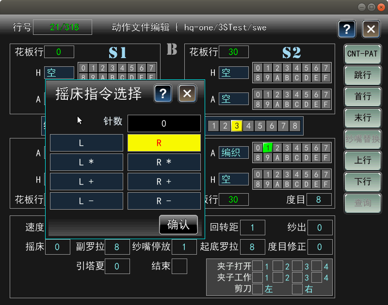

# CNT文件编辑

**触摸**：选择**\[CNT文件编辑\]**图标，点击进入CNT文件编辑页。单击右侧功能键和页面中所需修改区，弹出小键盘或修改窗口，根据编织需要修改设置。

**控制资料是编织资料中的主要资料，用于选针及读取其他需要使用的资料等。**

右侧功能键的说明：

| 行功能键 | 说明 |
| :---: | :---: |
| CNT-PAT | 切换至 PAT文件编辑页面 |
| 跳行 | 选择跳转行 |
| 首行 | 跳转至花板第一行 |
| 末行 | 跳转至花板最后一行 |
| 纱嘴替换 | 将原纱嘴替换成其他纱嘴 |
| 上行 | 上一行 |
| 下行 | 下一行 |
| 查询 | 保留 |

### **动作指令选择**

**触摸：**点击“H”或“A”后的方格，弹出动作指令选择框，单、双击选择所需动作。点击\[确认\]完成修改，点击右上角\[×\]退出当前操作。

### **色码编辑**

**触摸：**点击上图所示红框区域，弹出色码编辑框，单、双击选择所需色码。点击\[确认\]完成修改，点击右上角\[×\]退出当前操作。

### **纱嘴编辑**

**触摸：**点击“纱嘴”后的方格，弹出纱嘴编辑框，单、双击选择所需纱嘴号。点击\[确认\]完成修改，点击右上角\[×\]退出当前操作。

### **摇床指令选择**

**触摸：**单击“摇床”后的方格，弹出摇床指令选择，单、双击选择需要的摇床方式。点击\[确认\]完成修改，点击右上角\[×\]退出当前操作。

