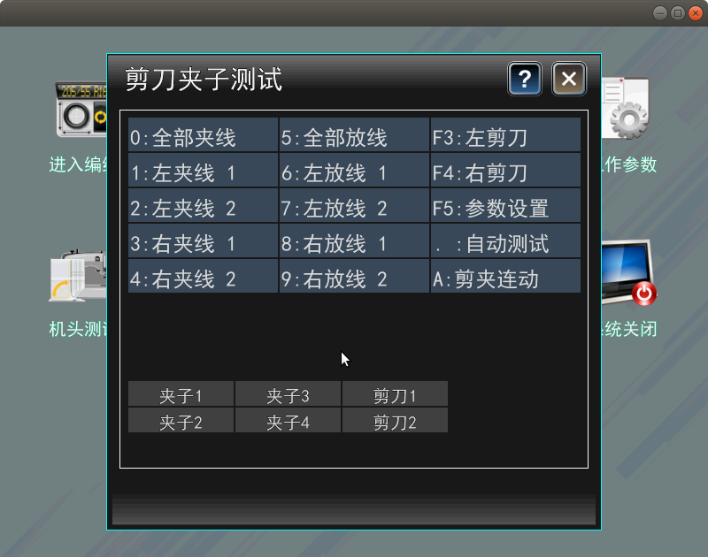

# 剪刀夹子测试

|   |   |   |
| :--- | :--- | :--- |
| 0：全部夹线 | 5：全部放线 | F3：左剪刀 |
| 1：左夹线 1 | 6：左放线 1 | F4：右剪刀 |
| 2：左夹线 2 | 7：左放线 2 | F5：参数设置 |
| 3：右夹线 1 | 8：右放线 1 | .：自动测试 |
| 4：右夹线 2 | 9：右放线 2 | A：剪夹连动 |

**触摸**：触笔单击对应的按钮选中执行测试。

### 状态栏

|   |   |   |
| :--- | :--- | :--- |
| 夹子 1 | 夹子 3 | 剪刀 1 |
| 夹子 2 | 夹子 4 | 剪刀 2 |

显示对应部件是否有响应。

### 剪刀夹子设置

点击按钮`F5：参数设置` 进入界面。

#### 左剪夹使能：

设定左侧剪刀夹子工作状态。

按键：方向键移动光标到指定位置，显示红色字体，按Enter键切换打开、关闭状态。  
触摸：触笔单击项目字符区，显示红色字体，再次单击切换打开、关闭状态。

#### 右剪夹使能：

设定右侧剪刀夹子工作状态。

按键：方向键移动光标到指定位置，显示红色字体，按Enter键切换打开、关闭状态。  
触摸：触笔单击项目字符区，显示红色字体，再次单击切换打开、关闭状态。

#### 剪线机头等待时间

设定机头在剪线动作停止等待的时间。  
范围：200--30000

按键：方向键移动光标到指定位置，按Enter键，显示带红色下划线红色字体，键入修改值，按Enter键结束。

触摸：触笔单击项目数值区，再次单击弹出软键盘，显示带红色下划线红色字体，输入设定值，单击确定键结束。

#### 剪刀工作速度

设定剪刀在工作时候的动作速度。  
范围：1--10

按键：方向键移动光标到指定位置，按Enter键，显示带红色下划线红色字体，键入修改值，按Enter键结束。

触摸：触笔单击项目数值区，再次单击弹出软键盘，显示带红色下划线红色字体，输入设定值，单击确定键结束。

#### 夹子工作速度

设定夹子在工作时候的动作速度。  
范围：1--10

按键：方向键移动光标到指定位置，按Enter键，显示带红色下划线红色字体，键入修改值，按Enter键结束。

触摸：触笔单击项目数值区，再次单击弹出软键盘，显示带红色下划线红色字体，输入设定值，单击确定键结束。

#### 剪刀剪线次数

设定剪刀剪断纱线动作的次数。  
范围：1--3

按键：方向键移动光标到指定位置，按Enter键，显示带红色下划线红色字体，键入修改值，按Enter键结束。

触摸：触笔单击项目数值区，再次单击弹出软键盘，显示带红色下划线红色字体，输入设定值，单击确定键结束。

