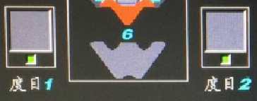

# 度目马达测试

### 度目马达测试

测试步进电机控制的度目机构。光标停留在对应的测试度目图标下。

| 电机位置 | 测试按键 | 说明 |
| :--- | :--- | :--- |
| 度目电机\(零位\) | 1 | 度目电机归零 |
| 度目电机 | 2 | 度目最大值的1/4 |
| 度目电机 | 3 | 度目最大值的2/4 |
| 度目电机 | 4 | 度目最大值的3/4 |
| 度目电机 | 5 | 度目最大值 |

### 度目马达自动测试 

|  **** |   |
| :--- | :--- |
| **触摸** | 单击**自动测试**键，停止测试再次单击自动键、Enter键或单击其它测试框 |
| **按键** | `按`**`.`**`键自动测试，按键盘上任意键停止测试` |

