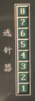

# 选针器测试

### **选针器测试**：

光标框移至选针器测试项，按相应数字键进行测试。选针器摆片有两种状态（摆上、摆下），连续点击同一数字键时，测试项图标根据摆片状态对应凹、凸状态（不同颜色）显示。

**触摸**：单击对应的选针器，点击对应软键盘上的数字进行测试。  
**按键**：光标框移至选针器测试项，按相应数字键进行测试。选针器摆片有两种状态（摆上、摆下），连续点击同一数字键时，测试项图标根据摆片状态对应凹、凸状态（不同颜色）显示。

| 图标状态 | 选针刀片 | 编织说明 |
| :--- | :--- | :--- |
| 凹下\(土灰\) | 摆上 | 有选针 |
| 凸出\(墨绿\) | 摆下\(默认\) | 无选针 |

| 数字键 | 选针刀片 |
| :--- | :--- |
| 1-8\(1-6\) | 所测选针器单个测试 |
| 9 | 所测选针器全部摆上 |
| 0 | 所测选针器全部摆下 |

摆片测试个数，根据系统参数设定 - 选针器刀片个数项所设定的数值。 摆片测试序号『1－8\(1－6\)』与前针床选针片自下而上对应\(后针床与前针床成镜像对称关系\)。

### **选针器自动测试**

|   |   |
| :--- | :--- |
| **触摸** | 单击**自动测试**键，停止测试再次单击自动键、Enter键或单击其它测试框 |
| **按键** | 按**`.`**键自动测试，按键盘上任意键停止测试 |

