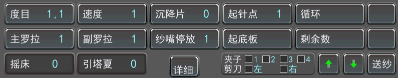

# 分隔框-下

### 度目

**显示编织系统的设定度目段信息，根据机头运行方向切换**

点击后，可进入**“&lt;工作度目设置&gt;”**界面

### 主罗拉

**显示主罗拉设定段信息**

点击后，可进入**“&lt;主罗拉编辑&gt;”**界面

### 摇床

**显示针板摇床时的信息**

### 速度

**显示机头编织速度设定段信息**

点击后，可进入**“&lt;机头速度设置&gt;”**界面

### 副罗拉

**显示副罗拉设定段信息**

点击后，可进入**“&lt;副罗拉编辑&gt;”**界面

### 沉降片

**显示沉降片分段设定信息**

分段功能需在制版时指定同时必须使用恒强科技自主研发的abc2.exe，abc3.exe编译后生效， 如未指定则使用第1段设定值

点击后，可进入**“&lt;生克电机设置&gt;”**界面

### 纱嘴停放

**显示纱嘴停放设定组信息**

点击后，可进入**“&lt;纱嘴停放点设置&gt;”**界面

### 详细

保留功能

### 起针点

**显示在“&lt;工作参数&gt;"页设定的起针点针数**

点击后，可进入**“&lt;工作参数设置&gt;”**界面

### 循环

**显示节约设定段节约次数**

制版规定大、小循环：1-199（次）  
系统设定大、小循环：1-1000（次）  
如需设定大于199次循环，可通过本系统提供的节约表设置、修改

点击后，可进入**“&lt;循环设定&gt;”**界面

### 剩余数

**显示当前循环编织时的剩余数值**

完成1次循环后，系统自动减1操作  
当前循环编织完成后，循环数自动清空，直至下一个循环设定段开始

点击后，可进入**“&lt;循环设定&gt;”**界面

### ↑

使**罗拉电机**顺时针转动，将布片往上拖动

### ↓

使**罗拉电机**逆时针转动，将布片往下拖动

### 送纱

**点击后，可进入“&lt;送纱器速度设置&gt;”界面**

### 引塔夏

保留功能

### 起底板

保留功能

