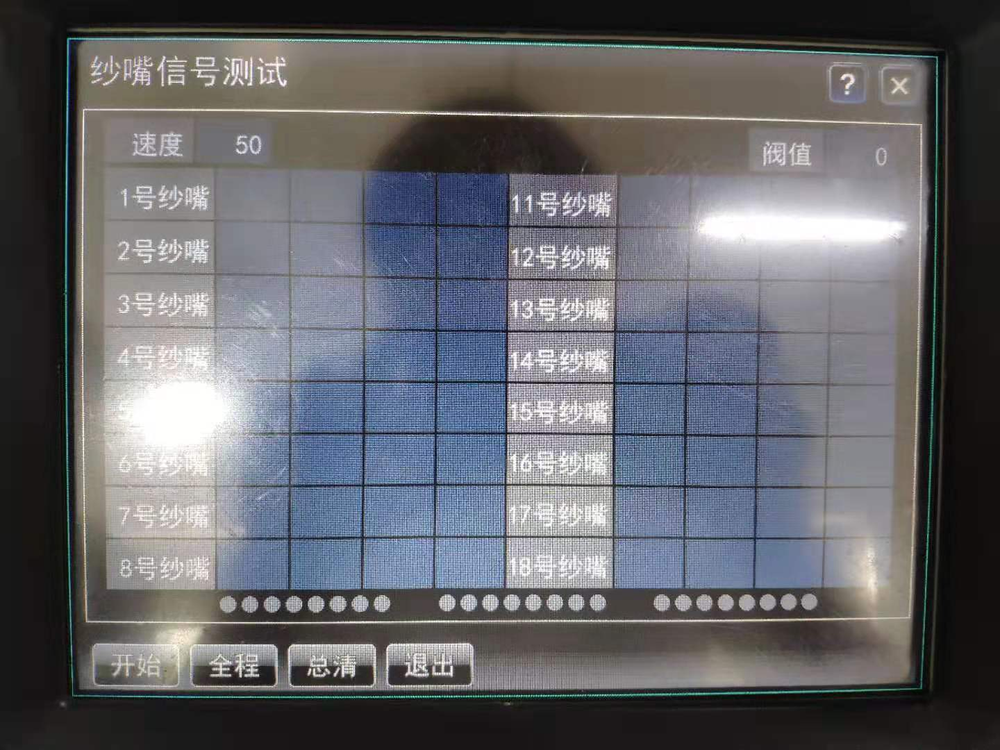

# 功能按键

**触摸**：单击编织运行界面 **详细** 按键，进入纱嘴信号测试界面

### 速度

设定测试阶段机头运行速度

范围：30 ～100  
默认：50

当机器处于运行状态下，速度界面左侧显示机头当前运行方向

**触摸**：单击数值区，弹出软键盘，键入数值，点击确定键完成

### 阀值

设定纱嘴信号检测到的脉冲宽度基准

当检测信号脉冲宽度小于阀值，颜色为红色；当检测信号脉冲宽度大于阀值，颜色为绿色。

当速度不同时，脉冲宽度也不同

**触摸**：单击数值区，弹出软键盘，键入数值，点击确认键完成

### 开始/结束

设定纱嘴信号检测是否开始

**注意**：当 **开始** 按键未选中时，拉动拉杆机头将无响应！

**触摸**：

1. 单击开始，弹出提示框，点击提示框确认，图标转变为选中状态（高亮、灰色的结束），此时拉动拉杆机头开始运行
2. 再次单击选中状态下图标，转变为初始状态下的 **开始** 按键

### 全程/短程

设定纱嘴信号测试时机头运行行程  
默认：全程

全程：机头运行针板的全部范围  
短程：机头根据系统内部设置，在指定的范围内运动

**触摸**：单击按键，切换 **全程/短程**

### 总清

清除纱嘴信号检测显示的所有数据

**触摸**：单击按键清除数据

### 退出

退出纱嘴信号检测界面

当退出界面后，需复位操作才能再次进行纱嘴信号检测

**触摸**：单击按键退出

