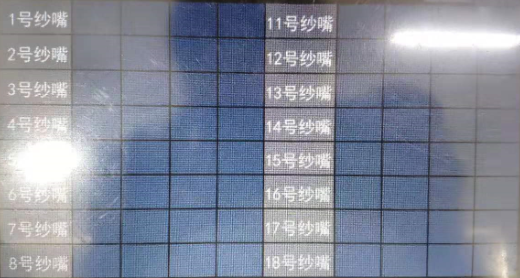

# 信号测试

## 信号指示灯

当对应纱嘴经过传感器时，相应的指示灯会亮起（绿色），离开后指示灯熄灭（灰色）

系统号：从左往右依次为 系统一、系统二、系统三

## 纱嘴信号

## 测试方法

在编织界面，先进行复位操作，将机器初始化。

将待测纱嘴依次排列在针板上方中间位置，设定好机头运行范围，点击开始按钮，拉动拉杆进行测试信号。

当传感器经过羊角，感应到其内的磁钢后，指示灯会亮起，传感器感应到的脉冲宽度会显示在对应的表格中。

