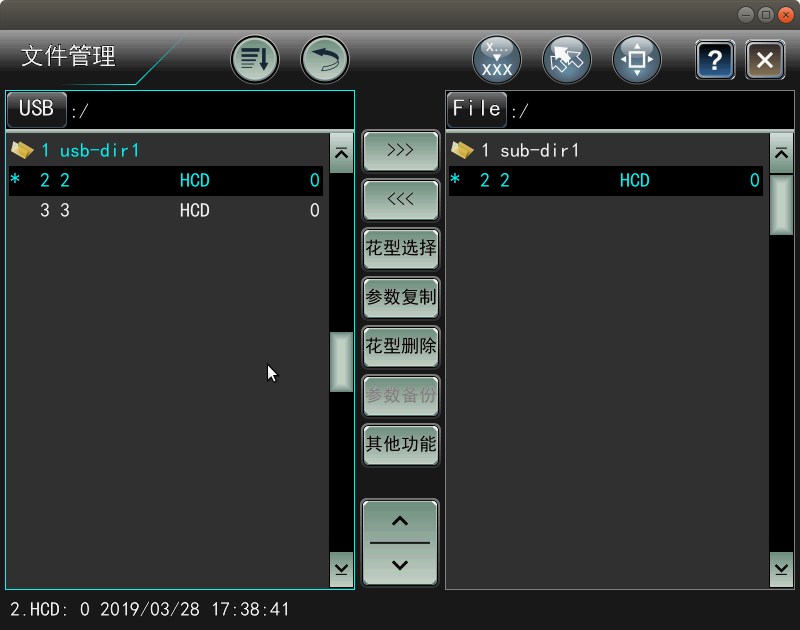

# 文件管理

全触摸文件管理窗口为恒强全新设计，将所有的文件操作均集中在此以便管理。   
窗口拆分左、右文件管理及中间操作按钮区。  
左侧：U 盘目录   
中间：操作按钮   
右侧：系统内存   
左、右侧支持文件输入、输出操作。

**文件操作支持多级目录结构** 

[1. 功能按键说明](gong-neng-an-niu-shuo-ming.md)  
[2. 文件输入](wen-jian-shu-ru.md)  
[3. 文件输出](wen-jian-shu-chu.md)   
[4. 花型选择 ](hua-xing-xuan-ze.md)  
[5. 参数复制](can-shu-fu-zhi.md)  
[6. 花型删除 ](hua-xing-shan-chu.md)  
[7. 参数备份 ](can-shu-bei-fen.md)  
[8. 其它功能 ](qi-ta-gong-neng/)  
    [8.1 工作参数输入](qi-ta-gong-neng/gong-zuo-can-shu-shu-ru.md)   
    [8.2 工作参数输出 ](qi-ta-gong-neng/gong-zuo-can-shu-shu-chu.md)  
    [8.3 系统参数输入 ](qi-ta-gong-neng/xi-tong-can-shu-shu-ru.md)  
    [8.4 系统参数输出 ](qi-ta-gong-neng/xi-tong-can-shu-shu-chu.md)  
    [8.5 总清内存花型](qi-ta-gong-neng/zong-qing-nei-cun-hua-xing.md)   
    [8.6 花型总输出](qi-ta-gong-neng/hua-xing-zong-shu-chu.md)   
    [8.7 程序升级](qi-ta-gong-neng/cheng-xu-sheng-ji.md)   
    [8.8 图形文件输入](qi-ta-gong-neng/tu-xing-wen-jian-shu-ru.md)  
    [8.9 厂标文件输入](qi-ta-gong-neng/chang-biao-wen-jian-shu-ru.md)   
    [8.10 分期付款 ](qi-ta-gong-neng/fen-qi-fu-kuan/)  
        [8.10.1 分期付款设置](qi-ta-gong-neng/fen-qi-fu-kuan/fen-qi-fu-kuan-she-zhi.md)   
        [8.10.2 成组数据导出 ](qi-ta-gong-neng/fen-qi-fu-kuan/cheng-zu-shu-ju-dao-chu.md)  
       [ 8.10.3 成组解锁操作 ](qi-ta-gong-neng/fen-qi-fu-kuan/cheng-zu-jie-suo-cao-zuo.md)  
        [8.10.4 分期付款查询](qi-ta-gong-neng/fen-qi-fu-kuan/fen-qi-fu-kuan-cha-xun.md)   
        [8.10.5 返回 ](qi-ta-gong-neng/fen-qi-fu-kuan/fan-hui.md)  
    [8.11 伺服参数维护](qi-ta-gong-neng/si-fu-can-shu-wei-hu/)   
       [ 8.11.1 伺服参数导出](qi-ta-gong-neng/si-fu-can-shu-wei-hu/si-fu-can-shu-dao-chu.md)   
        [8.11.2 伺服参数导入](qi-ta-gong-neng/si-fu-can-shu-wei-hu/si-fu-can-shu-dao-ru.md)   
        [8.11.3 返回]()

